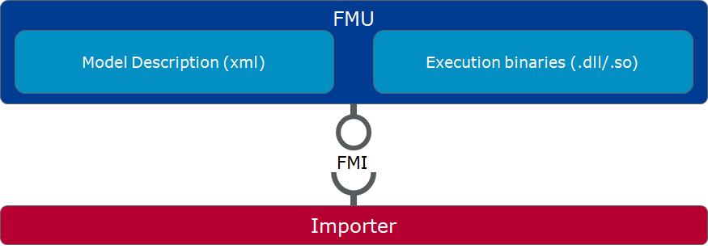
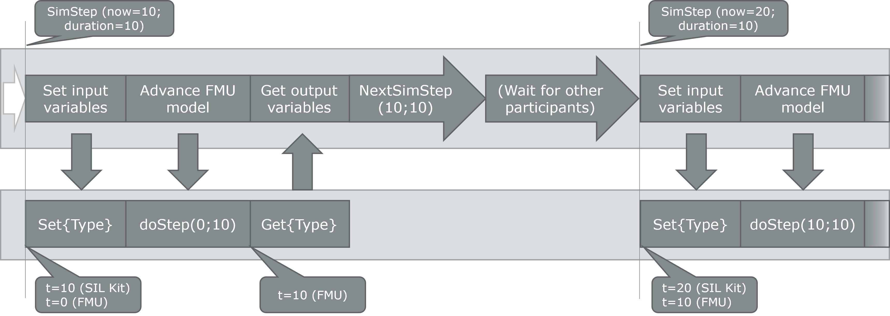
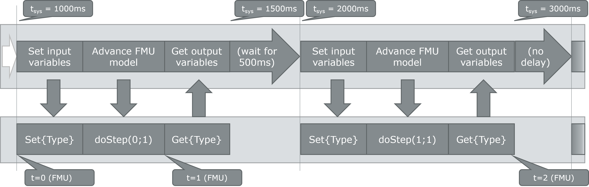
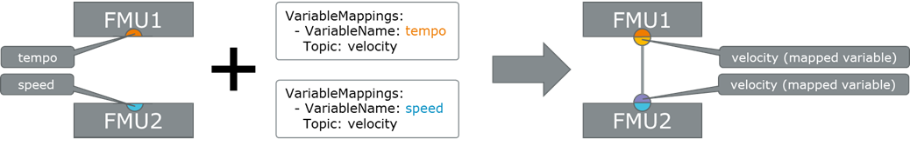

# SIL Kit FMU Importer

The SIL Kit FMU Importer is an extension for SIL Kit (downloadable on [GitHub](https://github.com/vectorgrp/sil-kit); documentation on [github.io](https://vectorgrp.github.io/sil-kit-docs/)) that allows to import Functional Mockup Units (FMUs, see [https://fmi-standard.org](https://fmi-standard.org/)) as SIL Kit participants and run them together with other participants (which may be other FMUs or other SIL Kit participants).

The FMU Importer is designed as a headless tool that does not need any user interaction.
Its behavior is configured by configuration files that are passed during launch.

## Table of Contents

1. [Overview of FMI](#overview-of-fmi)
2. [Setup](#setup)
    1. [Requirements](#requirements)
    2. [Build Instructions](#build-instructions)
        1. [FMU Importer](#fmu-importer)
        2. [vCDL Exporter](#vcdl-exporter)
3. [Running the FMU Importer](#running-the-fmu-importer)
4. [Data, Time, and Lifecycle Handling](#data-time-and-lifecycle-handling)
    1. [Variable Representation](#variable-representation)
    2. [Time and Lifecycle Management](#time-and-lifecycle-management)
    3. [Data Synchronization](#data-synchronization)
5. [Configuring the FMU and the FMU Importer](#configuring-the-fmu-and-the-fmu-importer)
    1. [Configuration Outline](#configuration-outline)
    2. [Available Options](#available-options)
        1. [Include](#include)
        2. [Parameters](#parameters)
        3. [VariableMappings](#variablemappings)
        4. [VariableMappings.Transformation](#variablemappingstransformation)
6. [Error Handling](#error-handling)

## **Overview of FMI**

The FMI (Functional Mockup Interface) standard defines "a ZIP archive and an application programming interface (API) to exchange dynamic models using a combination of XML files, binaries and C code: the Functional Mock-up Unit (FMU)" (see [https://fmi-standard.org/docs/3.0/#_overview](https://fmi-standard.org/docs/3.0/#_overview)).

In other words, an FMU represents a simulation component with defined parameter, output, and input variables in addition to an interface that allows to set and get those variables, control the simulation state of the FMU, and let the internal simulation time progress (and thus process the input variables).

The interface is stimulated through an _Importer_ - an external tool with the task to synchronize the input and output variables of FMUs and coordinate their simulation progress.



The SIL Kit FMU Importer has two roles

- make an FMU accessible as part of a SIL Kit simulation
- act as a distributed importer that uses SIL Kit's virtual time synchronization for time synchronization between FMUs and synchronize the input and output variables via publishers and subscribers.

## **Setup**

The SIL Kit FMU Importer ships as prebuilt portable packages.
This means that the FMU Importer requires an installed .NET 6 Runtime on the target machine.
The package itself provides executables for Windows and Linux.
The Linux distributables are tested on Ubuntu 22.04, but they should also run on other similar distributions.

Please refer to the section [Build Instructions](#build-instructions) if you want to build the FMU Importer yourself.

### **Requirements**

- .NET 6
  - [.NET's download site](https://dotnet.microsoft.com/en-us/download/dotnet/6.0) has guides on how to get .NET 6 for your OS
  - May also be installed as part of a Visual Studio (v17.2+ / 2022) installation
- SIL Kit* (only needed to run the FMU Importer; not required for build step)
  - Package can be downloaded from [GitHub (SIL Kit)](https://github.com/vectorgrp/sil-kit/releases)
  - The FMU Importer was tested with SIL Kit 4.0.47 and prebuilt packages ship with this SIL Kit version
- FMU Importer Source Code
  - Can be downloaded from [GitHub (FMU Importer)](https://github.com/vectorgrp/sil-kit-fmu-importer)

### **Build Instructions**

The FMU Importer comes with preconfigured projects.
The following sections provide instructions which projects you may build and what they do.
Manually built binaries of the projects usually build into the folder `_build/crossplatform-x64-{Configuration}`.

---

#### **FMU Importer**

To build the FMU Importer itself, open a terminal in the project's root directory (the one that contains FmuImporter.sln) and run the .NET build command

- Windows: `dotnet build ./FmuImporter/FmuImporter.csproj -c Debug --no-self-contained -r win-x64`

- Linux: `dotnet build ./FmuImporter/FmuImporter.csproj -c Debug --no-self-contained -r linux-x64`

This builds the FMU Importer with a `Debug` configuration (`-c Debug`) and the Importer will need an installed DotNet 6.0 (`--no-self-contained`).

You can find a separate section below on how to use the importer.

---

#### **vCDL Exporter**

This tool allows you to export the model descriptions of FMUs as a vCDL file that can be imported into CANoe. To build it, open a terminal in the VcdlExporter directory (the one that contains VcdlExporter.sln) and run the .NET build command

- Windows: `dotnet build ./VcdlExporter/VcdlExporter.csproj -c Debug --no-self-contained -r win-x64`

- Linux: `dotnet build ./VcdlExporter/VcdlExporter.csproj -c Debug --no-self-contained -r linux-x64`

Alternatively, you can open the solution file in Visual Studio and build the vCDL Exporter from there.

>Note: The vCDL exporter is currently a tool for internal debugging purposes and does not have any quality assurance.
You may encounter crashes while using it.

To export a vCDL you can run the following command from the folder where your vCDL Exporter binary resides:
`VcdlExporter <Path/To/Exported/vCDL> [<Path/To/FMU>]*`

You must provide the path to the vCDL output file (including its file extension) as the first argument and then the paths to your FMUs (including their file extension).
> Only FMU containers are supported (not already extracted FMUs).

---

## **Running the FMU Importer**

>Please make sure that you have a running and reachable SIL Kit registry before starting the FMU Importer executable.

>If you built the FMU Importer yourself, you may need to copy the SilKit.dll/libSilKit.so file from a SIL Kit release package (we recommend SIL Kit 4.0.47) to the root folder of your build directory (the same folder where FmuImporter[.exe] is located).

To run the FMU Importer, you need to run the following command from the directory your built execuable resides in:

`FmuImporter [options]`

Available options are:

| Option                                                      | Description |
|-------------------------------------------------------------|-------------|
| -f, --fmu-path \<fmu-path> (REQUIRED)                       | Set the path to the FMU file (.fmu). **This is mandatory.** |
| -s, --sil-kit-config-file \<sil-kit-config-file>            | Set the path to the SIL Kit configuration file. |
| -c, --fmu-importer-config-file \<fmu-importer-config-file>  | Set the path to the FMU Importer configuration file. |
| -p, --participant-name \<participant-name>                  | Set the name of the SIL Kit participant. [default: sil-kit-fmu-importer] |
| --time-sync-mode \<synchronized \| unsynchronized>          | Choose the time synchronization mode. [default: synchronized] |
| --version                                                   | Show version information |
| -?, -h, --help                                              | Show help and usage information |

After running the command, the FMU Importer will internally create a SIL Kit participant and connect to the SIL Kit registry configured in the SIL Kit configuration file.
If no configuration was provided or if it did not specify a registry URI, the default URI `silkit://localhost:8500` will be used.
The FMU Importer uses the SIL Kit logger for its output.
Therefore, you need to provide a SIL Kit configuration file that contains a `Logging` section to see any output provided by the FMU Importer.
The FMU Importer prints most of its logs on the `Info` level, but in case an error occurs, there is one log message on the `Error` level that contains the error message and a log message on the `Debug` level that contains the error message including further information (such as a stack trace) to track the error's origin more easily.

## **Data, Time, and Lifecycle Handling**

From an FMU's point of view, the FMU Importer acts as a master (FMI 2.0)/importer (FMI 3.0).
As such, the Importer will handle the data exchange via SIL Kit, the time management, and the lifecycle of the FMU.
The FMU Importer does not provide any numeric solvers or interpolation mechanisms.
Therefore, it only supports FMUs that can run in `co-simulation` mode.

### **Variable Representation**

The FMU Importer exposes an FMU's variables as DataPublisher and DataSubscriber services to other SIL Kit simulation participants.
By default, the variable's name is used as the topic name by the SIL Kit service.
The FMU Importer maps the different kinds of variable types as follows:
| Variable Type         | Created Service |
|-----------------------|-----------------|
| Input                 | DataSubscriber  |
| Independent           | DataPublisher   |
| Output                | DataPublisher   |
| Parameter             | DataPublisher   |
| Structural parameter  | DataPublisher   |

It is also possible to change the default mapping.
See [Configuring the FMU Importer](#configuring-the-fmu-importer) for details.

### **Time and Lifecycle Management**
The FMU Importer uses the simulation step size provided by the FMU's model description as simulation step size for the FMU, if it is available.
In case the simulation step size is not available, the FMU Importer requires users to provide the simulation step size via the FMU Importer configuration file.
If neither the FMU nor the configuration file provide a step size, the FMU Importer will exit and show an error message.

The FMU Importer provides time synchronization modes that allows users to choose, how virtual time shall be handled by the FMU Importer:
* `Synchronized` (default): The FMU Importer's simulation time will be synchronized with other SIL Kit participants through SIL Kit's _virtual time synchronization_.
  If active, it ensures that all data from previous points in virtual time were received before processing the next simulation step.
  An FMU Importer that uses virtual time synchronization will execute the FMU's simulation steps as soon as the SIL Kit component signals that a simulation step may be performed.
  In addition, the FMU Importer coordinates its SIL Kit lifecycle with other SIL Kit participants.
  This means that the FMU Importer will first wait until all required participants have joined the SIL Kit simulation and then coordinates the lifecycle state with them.
  For details about SIL Kit's virtual time synchronization, refer to the [SIL Kit Documentation](https://vectorgrp.github.io/sil-kit-docs/).
  Further, if any of the required participants stops the simulation, all other participants, including the FMU Importer, will stop as well.
  >Please make sure to start a `sil-kit-system-controller` (part of SIL Kit) that comprises the FMU Importer's participant name as well as all other required participants.

* `Unsynchronized`: If the FMU Importer does not use virtual time synchronization, the simulation step execution will be artificially slowed down to to match the system's wall clock.
  For example, a one second simulation step would also take approximately one second in real time.
  It is important to note that the FMU Importer is not designed as a real-time application and cannot guarantee that the simulation steps will always have a perfect alignment with the real time, but it will stay as close as possible in the long run.
  In case it is not possible to execute the simulation step in time, the simulation will be executed as fast as possible.
  As an unsynchronized SIL Kit participant, FMU Importer receives its SIL Kit data without a timestamp and therefore schedules all messages to be provided to the FMU in the next simulation step (see [below](#data-synchronization) for details).

> The time synchronization mode only affects how the FMU Importer interacts with SIL Kit, but it does not affect how the FMU Importer interacts with the FMU.


### **Data Synchronization**

As mentioned in [Variable Representation](#variable-representation), input variables with the same name as other FMUs' output variables are connected and therefore receive their data.

The general procedure to synchronize the data between SIL Kit and the FMU is similar in `synchronized` and `unsynchronized` time synchronization mode (see [Time and Lifecycle Management](#time-and-lifecycle-management)):

1. Once SIL Kit grants the execution of the next simulation step, the FMU Importer provides all updated variable values to the FMU.
When receiving data for a specific variable more than once before a simulation time step is executed, the last received value is used ("last-is-best").
2. The simulation step of the FMU is executed.
3. All output variables are read from the FMU and published via SIL Kit.

> (Structural) parameters are only published at the beginning of a simulation (t=0), because they are not meant to change after the simulation started.

<details>
  <summary>Sequence of a synchronized simulation step</summary>


</details>

<details>
  <summary>Sequence of an unsynchronized simulation step</summary>


</details>

---

## **Configuring the FMU and the FMU Importer**

The FMU Importer can be optionally provided with a configuration file that affects, how the FMU Importer synchronizes data and time between the FMU and a SIL Kit simulation.
Further, it allows to override the default values of parameter variables.

### **Configuration Outline**

The configuration file is expected to be a valid YAML file with the following outline:

```yaml
    Version: 1

    Include:
    - ...

    Parameters:
    - ...

    VariableMappings:
    - ...

    IgnoreUnmappedVariables: False

    StepSize: 1000000
```

To help write this file, you may use the schema named `FmuImporterConfiguration.schema.json` in the root directory of the release package.
It depends on your code editor if it supports YAML schemas and how they can be used.
For instance, if you use Visual Studio Code with the Red Hat YAML extension, you can use the schema by adding the following first line to your configuration file:
```yaml
# yaml-language-server: $schema=</path/to/FmuImporter>/FmuImporterConfiguration.schema.json
```

### **Available Options**

| Setting Name                          | Type           | Description |
|---------------------------------------|----------------|-------------|
| Version                               | Integer        | The version of the config format (mandatory). |
| [Include](#include)                   | Array\<String> | Used to include contents of other valid FMU Importer configuration files. |
| [Parameters](#parameters)             | Array\<Object> | Used to override default values of parameters. |
| [VariableMappings](#variablemappings) | Array\<Object> | Used to modify how a variable is represented in a SIL Kit simulation. |
| IgnoreUnmappedVariables               | Boolean        | Set to true to prevent synchronization of variables that are not listed in VariableMappings (including parameters). |
| StepSize                              | Integer        | Simulation step size in ns. Overrides step size provided by FMU (if available). |

#### **_Include_**

Used to include contents of other valid FMU Importer configuration files.
Imported configuration files are evaluated before local definitions (e.g., parameters or variable mappings) are applied.
Local definitions take precedence over imported definitions.
In case of circular imports, a file will only be imported the first time it is encountered.

Syntax:
```yaml
Include:
  - <path/to/fmu-importer-config>
  - ...
```

The paths to the included files can either absolute or relative to the including configuration file.

#### **_Parameters_**

Used to override default values of parameters.
Each entry of the list must have the following attributes:

| Attribute Name | Type   | Description |
|----------------|--------|-------------|
| VariableName   | String | Name of the variable in the model description. |
| Value          | Object | Value of the parameter. Type must match the definition in the model description. |

The `Value` attribute may be one of the following:
* A string (with single (`'`) or double (`"`) quotes) even if the content of the string is a numeric value;
* A numeric value (example: `42`, `3.14`). If it's not representable by an integer type of size 64 bits or a double-precision floating point due to overflow, it'll be considered a string;
* A list of the above (lists nesting is not supported).

If the `VariableName` designates a variable whose type is an enumeration, integer values are interpreted as the the enumerator's underlying value. If it is a string, it is interpreted as an enumerator's name and the value is taken from the Model Description.

In the case where the `VariableName` designates a variable whose type is a multi-dimensional array, the `Value` attribute is the flattened array which will be used to initialise the variable.

Syntax:
```yaml
Parameters:
  - VariableName: <name-in-model-description>
    Value: <new-start-value>
  - VariableName: <enum-typed-variable-name-in-model-description>
    Value: "<name-of-enumerator-used-as-start-value>"
  - VariableName: <array-name-in-model-description>
    Value:
      - <first-item-of-the-start-value>
      - <second-item-of-the-start-value>
      - ...
  - ...
```

#### **_VariableMappings_**

Used to modify how a variable is represented in a SIL Kit simulation.
The following properties of a variable can be modified:

| Attribute Name                                    | Type   | Description |
|---------------------------------------------------|--------|-------------|
| VariableName                                      | String | Name of the variable in the model description (mandatory). |
| TopicName                                         | String | The topic under which the publisher / subscriber that corresponds to the variable sends / receives the data. This means that input and output variables with the same topic name are connected. |
| [Transformation](#variablemappingstransformation) | Object | Allows to add a linear transformation (factor and offset) and a typecast to the data before it is serialized by SIL Kit. |

In the example below, there are two FMUs (FMU1 and FMU2) with variables that should be connected.
However, they need to be reconfigured, because they do not have the same name.
After applying configurations with the shown excerpts to their FMU Importers, the variables are connected.



#### **VariableMappings.Transformation**

In addition to the optional transformation that is part of a variable's unit, the FMU Importer allows to additional linear transformation as well as a type cast for floating point numbers and integers.
If a linear transformation is applied to an integer, the result will be type casted from the resulting floating point number to the original integer type.

The point in time when the transformations are applied depends on the variable type:
- `Output variables:`
The linear transformation is applied after the UnitDefinition's transformation.
The result is then cast to the target transmission type, serialized, and sent via the variable's corresponding SIL Kit DataPublisher.
- `Input variables:`
Once received by SIL Kit's DataSubscriber, the data is cast from the provided transmission type to the variable's data type.
Then, the linear transformation is applied.
At last, the FMU's unit transformation is applied.

The following properties of a variable can be modified:

| Attribute Name   | Type    | Description |
|------------------|---------|-------------|
| Factor           | Double  | First order part of the linear transformation. Applied before the offset. |
| Offset           | Double  | Constant offset of the linear transformation. Applied after the factor. |
| TransmissionType | String  | Data encoding in SIL Kit. If necessary, the data is converted between the SIL Kit and the FMU components. Allowed values: "Int8", "Int16", "Int32", "Int64", "UInt8", "UInt16", "UInt32", "UInt64", "Float", "Float32", "Double", "Float64" |
| ReverseTransform | Boolean | Allows to reverse transformation if original factor and offset are known. |

Syntax:
```yaml
VariableMapping:
  - VariableName: <name-in-model-description>
    TopicName: <topic-name-in-sil-kit>
    Transformation: 
      Factor: <factor-of-linear-transform>
      Offset: <offset-of-linear-transform>
      TransmissionType: {"Int8"|"Int16"|"Int32"|"Int64"|"UInt8"|"UInt16"|"UInt32"|"UInt64"|"Float"|"Float32"|"Double"|"Float64"}
      ReverseTransform: {true|false}
  - ...
```

---

## **Error Handling**
If the FMU Importer detects an issue, it will generally exit after terminating the FMU and stopping its SIL Kit lifecycle.
* The error message is logged on an `Error` log level.
* A more extensive error description is logged on the `Debug` log level.
This includes a stack trace if the error originated from an exception.

If the FMU Importer exited without any issues, the exit code will be 0.
All other exit codes set by the FMU Importer have four digits, of which the first digit indicates the component that reported the error:
* 1-49: The error originated in the FMU Importer itself
* 50-99: The error originated in the FMI binding
* 100+: The error originated in the SIL Kit binding

The following table lists the meaning of the current exit codes:


| Code | Origin          | Description |
|------|-----------------|-------------|
|  0   | FMU Importer    | The application terminated successfuly |
|  1   | FMU Importer    | Error during initialization |
|  2   | FMU Importer    | Error during simulation |
|  3   | FMU Importer    | Error during FMU's simulation step execution |
|  4   | FMU Importer    | Error during user callback execution |
|  5   | FMU Importer    | One of the required or provided files was not found |
| 49   | FMU Importer    | Encountered an unknown or unspecified error |
| 51   | FMI Binding     | Failed to load a library, most likely the FMU's .dll or .so file |
| 52   | FMI Binding     | Failed to read the FMU's model description file |
| 53   | FMI Binding     | FMU failed to terminate |
| 54   | FMI Binding     | FMU failed due to call that return with 'discard' status code  |
| 55   | FMI Binding     | FMU failed due to call that return with 'error' status code |
| 56   | FMI Binding     | FMU failed due to call that return with 'fatal' status code |
| 101  | SIL Kit Binding | Failed to log using SIL Kit's logger |
