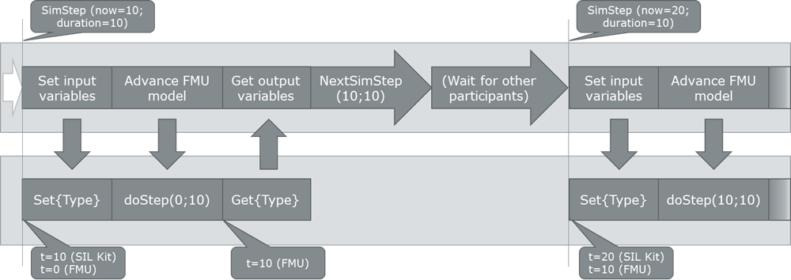

# SIL Kit FMU Importer

The SIL Kit FMU Importer is an extension for SIL Kit (downloadable on [GitHub](https://github.com/vectorgrp/sil-kit); documentation on [github.io](https://vectorgrp.github.io/sil-kit-docs/)) that allows to import Functional Mockup Units (FMUs, see [https://fmi-standard.org](https://fmi-standard.org/)) as SIL Kit participants and run them together with other participants (which may be other FMUs or other SIL Kit participants).

The FMU Importer is designed as a headless tool that does not need any user interaction.
Its behavior is configured by configuration files that are passed during launch.

## Table of Contents

1. [Overview of FMI](#overview-of-fmi)
2. [Setup](#setup)
    1. [Requirements](#requirements)
    2. [Build Instructions](#build-instructions)
        1. [FMU Importer](#fmu-importer)
        2. [vCDL Exporter](#vcdl-exporter)
3. [Running the FMU Importer](#running-the-fmu-importer)
4. [Data and Time Synchronization between SIL Kit and FMUs](#data-and-time-synchronization-between-sil-kit-and-fmus)
    1. [Time](#time)
    2. [Variable Representation](#variable-representation)
    3. [Data Synchronization](#data-synchronization)
5. [Configuring the FMU Importer](#configuring-the-fmu-importer)
    1. [Configuration Outline](#configuration-outline)
    2. [Available Options](#available-options)
        1. [Include](#include)
        2. [Parameters](#parameters)
        3. [VariableMappings](#variablemappings)
        4. [VariableMappings.Transformation](#variablemappingstransformation)

## **Overview of FMI**

The FMI (Functional Mockup Interface) standard defines "a ZIP archive and an application programming interface (API) to exchange dynamic models using a combination of XML files, binaries and C code: the Functional Mock-up Unit (FMU)" (see [https://fmi-standard.org/docs/3.0/#_overview](https://fmi-standard.org/docs/3.0/#_overview)).

In other words, an FMU represents a simulation component with defined parameter, output, and input variables in addition to an interface that allows to set and get those variables, control the simulation state of the FMU, and let the internal simulation time progress (and thus process the input variables).

The interface is stimulated through an _Importer_ - an external tool with the task to synchronize the input and output variables of FMUs and coordinate their simulation progress.


The SIL Kit FMU Importer has two roles

- make an FMU accessible as part of a SIL Kit simulation
- act as a distributed importer that uses SIL Kit's virtual time synchronization for time synchronization between FMUs and synchronize the input and output variables via publishers and subscribers.

## **Setup**

Currently, the SIL Kit FMU Importer does not provide prebuilt packages.
Therefore, you must build them yourselves before you can run the tool.

### **Requirements**

- .NET 6
  - [.NET's download site](https://dotnet.microsoft.com/en-us/download/dotnet/6.0) has guides on how to get .NET 6 for your OS
  - May also be installed as part of a Visual Studio (v17.2 / 2022) installation
- SIL Kit* (only needed to run the FMU Importer; not required for build step)
  - Package can be downloaded from [GitHub](https://github.com/vectorgrp/sil-kit/releases)
  - The FMU Importer was tested with SIL Kit 4.0.26 and prebuilt packages ship with this SIL Kit
- FMU Importer Source Code
  - Can be downloaded from GitHub* (not available yet)

### **Build instructions**

The FMU Importer comes with preconfigured projects.
The following sections provide instructions which projects you may build and what they do.
Manually built binaries of the projects usually build into the folder `_build/crossplatform-x64-{Configuration}`.

---

#### **FMU Importer**

To build the FMU Importer itself, open a terminal in the project's root directory (the one that contains FmuImporter.sln) and run the .NET build command

- Windows: `dotnet build ./FmuImporter/FmuImporter/FmuImporter.csproj -c Debug --no-self-contained -r win-x64`

- Linux: `dotnet build ./FmuImporter/FmuImporter.csproj -c Debug --no-self-contained -r linux-x64`

This builds the FMU Importer with a `Debug` configuration (`-c Debug`) and the Importer will need an installed DotNet 6.0 (`--no-self-contained`).

You can find a separate section below on how to use the importer.

---

#### **vCDL Exporter**

This tool allows you to export the model descriptions of FMUs as a vCDL file that can be imported into CANoe. To build it, open a terminal in the project's root directory (the one that contains FmuImporter.sln) and run the .NET build command

- Windows: `dotnet build ./VcdlExporter/VcdlExporter.csproj -c Debug --no-self-contained -r win-x64`

- Linux: `dotnet build ./VcdlExporter/VcdlExporter.csproj -c Debug --no-self-contained -r linux-x64`

>Note: The vCDL exporter is currently a tool for internal debugging purposes and does not have any quality assurance.
You may encounter crashes while using it.
Also, the exporter may be removed from this project in an upcoming version.

To export a vCDL you can run the following command from the folder where your vCDL Exporter binary resides:
`VcdlExporter <Path/To/Exported/vCDL> [<Path/To/FMU>]*`

You must provide the path to the vCDL output file (including its file extension) as the first argument and then the paths to your FMUs (including their file extension).
> Only FMU containers are supported (not already extracted FMUs).

---

## **Running the FMU Importer**

>Please make sure that you have a running and reachable SIL Kit registry before starting the FMU Importer executable.

>If you built the FMU Importer yourself, you may need to copy the SilKit.dll/libSilKit.so file from a SIL Kit release package (we recommend SIL Kit 4.0.26) to the root folder of your build directory (the same folder where FmuImporter[.exe] is located).

To run the FMU Importer, you need to run the following command from the directory your built execuable resides in:

`FmuImporter [options]`

Available options are:

| Option | Description |
| ------ | ----------- |
|-f, --fmu-path \<fmu-path> (REQUIRED) | Set the path to the FMU file (.fmu). This is mandatory. |
| -c, --sil-kit-config-file \<sil-kit-config-file> | Set the path to the SIL Kit configuration file. Defaults to an empty configuration. |
| -p, --participant-name \<participant-name> | Set the name of the SIL Kit participant. Defaults to `sil-kit-fmu-importer`. |
| -?, -h, --help | Show help and usage information |

After running the command, the FMU Importer will internally create a SIL Kit participant and connect to the SIL Kit registry configured in the SIL Kit configuration file.
If none was provided or if the configuration file did not specify a registry URI, the default URI `silkit://localhost:8500` will be assumed.

>The FMU Importer starts a SIL Kit participant that uses a coordinated lifecycle and virtual time synchronization.
This means that you need to start a `sil-kit-system-controller` (part of SIL Kit) that comprises the FMU Importer's participant name as well as all other required participants.

## **Data and Time Synchronization between SIL Kit and FMUs**

### **Time**

By default, the FMU Importer requests the same simulation step size on the SIL Kit side as it is provided in the FMU's model description.
It is possible to change the simulation step size on the SIL Kit side (see [Available Options](#available-options)).

### **Variable Representation**

The FMU Importer creates a data publisher for each output variable and parameter and use its the variable name as topic for the publisher.
Respectively, input variables are represented as subscribers, also with their variable name as topic name.
As a result, variables with the same name are 'connected' by the FMU Importer.
See [Configuring the FMU Importer](#configuring-the-fmu-importer) for details how to change the topic of a variable.

### **Data Synchronization**

As mentioned in [Variable Representation](#variable-representation), input variables with the same name as other FMUs' output variables are connected and therefore receive their data.
When receiving data for a specific variable more than once in a simulation time step, the last received value is used ('last-is-best').

Internally, the FMU Importer waits until the SIL Kit participant receives the permission to advance its simulation step.
Once received, it transfers all received data with a valid timestamp (-> data with a timestamp of the last granted simulation time) and advances the simulation to the SIL Kit participant's current virtual time.



---

## **Configuring the FMU Importer**

The FMU Importer can be optionally provided with a configuration file that affects, how the FMU Importer synchronizes data and time between the FMU and a SIL Kit simulation.

### **Configuration Outline**

The configuration file is expected to be a valid YAML file with the following outline:

```yaml
    Version: 1

    StepSize: 1000000

    Include:
    - ...

    Parameters:
    - ...

    VariableMappings:
    - ...

    IgnoreUnmappedVariables: False
```

### **Available Options**

| Setting Name                                    | Description |
|-------------------------------------------------|-------------|
| Version                                         | The version of the config format (mandatory). |
| StepSize                                        | simulation step size in ns. |
| [Include](#include)                             | Used to include contents of other valid FMU Importer configuration files. |
| [Parameters](#parameters)                       | Used to override default values of parameters. |
| [VariableMappings](#variablemappings)           | Used to modify how a variable is represented in a SIL Kit simulation. |
| IgnoreUnmappedVariables | Set to true to prevent synchronization of variables that are not listed in VariableMappings (including parameters). |

#### **_Include_**

Used to include contents of other valid FMU Importer configuration files.
Imported configuration files are evaluated before local definitions (e.g., parameters or variable mappings) are applied.
Local definitions take precedence over imported definitions.
In case of circular imports, a file will only be imported the first time it is encountered.

#### **_Parameters_**

Used to override default values of parameters.
Each entry of the list comprises two attributes:

| Attribute Name | Description |
|----------------|-------------|
| VariableName        | Name of the variable in the model description (mandatory). |
| Value          | Value of the parameter. Format must match the definition in the model description. |

#### **_VariableMappings_**

Used to modify how a variable is represented in a SIL Kit simulation.
The following properties of a variable can be modified:

| Attribute Name | Description |
|----------------|-------------|
| VariableName        | Name of the variable in the model description (mandatory). |
| TopicName          | The topic under which the publisher / subscriber that corresponds to the variable sends / receives the data. This means that input and output variables with the same topic name are connected. |
| [Transformation](#variablemappingstransformation)        | Allows to add a linear transformation (factor and offset) and a typecast to the data before it is serialized by SIL Kit. |

In the example below, there are two FMUs (FMU 1 and FMU 2) with variables that should be connected. However, they need to be reconfigured, because they do not have the same name. After applying configurations with the shown excerpts to their FMU Importers, the variables are connected.


#### **VariableMappings.Transformation**

In addition to the optional transformation that is part of a variable's unit, an additional transformation can be defined.
This transformation can also be applied to Integer values.
The resulting value is converted to an integer value.

- `Output variables:` The transformation is applied after the UnitDefinition's transformation and before it is serialized and sent via the variable's corresponding SIL Kit DataPublisher.
- `Input variables:` The transformation is applied after the data was received and deserialized via the variable's corresponding SIL Kit DataSubscriber and before the FMUs unit transformation is applied.
